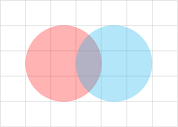

---
hide:
  - navigation
---



---

<div style="display: flex; justify-content: center; align-items: center; column-gap: 1em; margin: 0 auto; flex-wrap: wrap" markdown>
```latex
%%tikz
\begin{tikzpicture}
    \draw[help lines] grid (7, 5);
     \filldraw [color=red, opacity=0.3] (2.5,2.5) circle (1.5);
     \filldraw [color=cyan, opacity=0.3] (4.5,2.5) circle (1.5);
\end{tikzpicture}
```
{height="300"}
</div>


---

<div style="display: flex; justify-content: center; margin: 0 auto;">
<pre style="min-width: 16em; height: 2em;">
<code class="language-shell">pip install jupyter-tikz</code>
</pre>
</div>


---

# Getting started

{{ description }}



## Next steps

Choose the following links to continue your journey:

<div class="grid">
  
    <a class="card card-link" href="{{ href }}"><span class="twemoji">{{ icons[icon] }}</span> {{ text }}</a>
  
</div>


## Project Links

Explore additional resources and related links for this project:

<div class="grid">
 
  <a class="card card-link" href="https://pypi.org/project/jupyter-tikz/" target="_blank"><span class="twemoji">{{ icons[icon] }}</span> {{ text }}</a>
 
</div>



