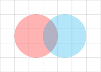

---
hide:
  - navigation
---



---

<div class="code-showcase" markdown>
```latex
%%tikz
\begin{tikzpicture}
    \draw[help lines] grid (7, 5);
     \filldraw [color=red, opacity=0.3] (2.5,2.5) circle (1.5);
     \filldraw [color=cyan, opacity=0.3] (4.5,2.5) circle (1.5);
\end{tikzpicture}
```
<div class="result-showcase">

</div>
</div>


---

<div style="display: flex; justify-content: center; margin: 0 auto;">
<pre style="height: 4em; overflow-x: auto;">
<code class="language-shell" style="padding-right: 3em;">pip install jupyter-tikz</code>
</pre>
</div>


---

# Getting started
{{ description }}

## Basic Usage



## Next steps

Choose the following links to continue your journey:

<div class="grid">
  
    <a class="card card-link" href="{{ href }}"><span class="twemoji">{{ icons[icon] }}</span> {{ text }}</a>
  
</div>

## Project Links

Explore additional resources and related links for this project:

<div class="grid">
 
  <a class="card card-link" href="{{ href }}"><span class="twemoji">{{ icons[icon] }}</span>&nbsp; {{ text }}</a>
 
</div>

## Contribute



## Thanks



## License

