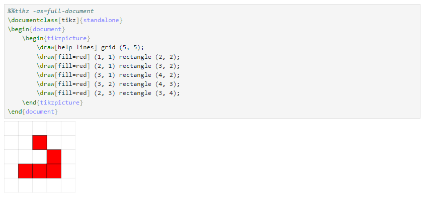

---
hide:
  - navigation
---

## Prerequisites

Before start the installation, you should verify if the minimal dependencies are installed.

### LaTeX

LaTeX must be installed using one of the following distributions:

- [TeX Live](https://tug.org/texlive/) (All Platforms)
- [MikTeX](https://miktex.org/) (Windows)
- [MacTeX](https://www.tug.org/mactex/) (Mac)

You can test if a LaTeX distribution is installed by using the following command:

```latex
pdflatex --version
```
<div class="result" style="font-family: monospace;">
MiKTeX-pdfTeX 4.19 (MiKTeX 24.4)<br>
© 1982 D. E. Knuth, © 1996-2023 Hàn Thế Thành<br>
TeX is a trademark of the American Mathematical Society.
</div>

### Poppler

This application requires Poppler’s `pdftocairo`. You must install it beforehand.

#### Conda - Platform Independent

```shell
conda install -c conda-forge poppler
```

#### Windows

Download Poppler for Windows [here](https://github.com/oschwartz10612/poppler-windows/releases/). You must add the `bin` folder to your [PATH](https://www.c-sharpcorner.com/article/how-to-addedit-path-environment-variable-in-windows-11/).

#### Linux

Most distributions come with `pdftocairo`. If it is not installed, refer to your package manager to install `poppler-utils`.

#### Mac

Install using `brew`:

```shell
brew install poppler
```

#### Checking the Installation

Finally, you can check if the `pdftocairo` utility is installed by using the following command in your terminal:

```shell
pdftocairo -v
```

<div class="result" style="font-family: monospace;">
pdftocairo version 24.04.0<br>
Copyright 2005-2024 The Poppler Developers - http://poppler.freedesktop.org<br>
Copyright 1996-2011, 2022 Glyph & Cog, LLC
</div>

#### Using custom pdftocairo path

Alternatively, if you are facing issues, you can configure the `pdftocairo` location (exclusive for use in `jupyter_tikz`) by setting the environment variable `JUPYTER_TIKZ_PDFTOCAIROPATH`:


``` { .python .annotate }
import os
custom_pdftocairo_path = os.path.join(
  os.getenv("LOCALAPPDATA"), "Poppler", "Library", "bin", "pdftocairo.exe"
) # (1)!
os.environ["JUPYTER_TIKZ_PDFTOCAIROPATH"] = custom_pdftocairo_path
```

1. The directory of `pdftocairo` binary.

### Jinja2 (Optional)

Jinja2 is only necessary if you plan to use [Jinja2 templates](http://jinja.pocoo.org/docs/latest/templates/). To install it, use:

```shell
pip install jinja2
```

## Install Jupyter TikZ

You can install `jupyter-tikz` by using the following command in your terminal:

``` { .shell .annotate }
pip install jupyter-tikz # (1)!
```

1. You can install with your favorite package manager, i.e., `poetry`.

## Adding TikZ Syntax highlight

If you are using Jupyter Lab 4. You can add LaTeX highlight to `%%tikz` magic cells by using [JupyterLab-lsp](https://jupyterlab-lsp.readthedocs.io/en/latest/Installation.html) and editing [this part of the code in JupyterLab-lsp](https://github.com/jupyter-lsp/jupyterlab-lsp/blob/b159ae2736b26463d8cc8f0ef78f4b2ce9913370/packages/jupyterlab-lsp/src/transclusions/ipython/extractors.ts#L68-L74) in the file `extractor.ts`:

```ts
new RegExpForeignCodeExtractor({
  language: 'latex',
  pattern: '^%%(latex|tikz)( .*?)?\n([^]*)', // Add tikz support to this line
  foreignCaptureGroups: [3],
  isStandalone: false,
  fileExtension: 'tex'
}),
```

Now, you will have LaTeX syntax code highlighting for `%%tikz` magic cells, as demonstrated below:



For more information refer to this <a href="https://discourse.jupyter.org/t/getting-syntax-highlighting-to-work-for-custom-cell-magic/11734/9" target="_blank"> link
</a>.