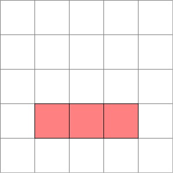



## Basic usage

First, you need to load the `jupyter_tikz` extension in your Jupyter Notebook. You can do this by running the following code cell:

```python
%load_ext jupyter_tikz
```

Then, create a simple `tikzpicture`:

```latex
%%tikz
\begin{tikzpicture}
    \draw[help lines] grid (5, 5);
    \draw[fill=black] (1, 1) rectangle (2, 2);
    \draw[fill=black] (2, 1) rectangle (3, 2);
    \draw[fill=black] (3, 1) rectangle (4, 2);
    \draw[fill=black] (3, 2) rectangle (4, 3);
    \draw[fill=black] (2, 3) rectangle (3, 4);
\end{tikzpicture}
```
<div class="result" markdown>

</div>

Finally, if you forget the usage, as for help by typing `%tikz?`, or visit **additional options** reference [here](../arguments.md).

```python
%tikz?
```
<div class="result" style="padding-right: 0;">
<div class="log-output">
<pre>
%tikz [-as INPUT_TYPE] [-i] [-f] [-p LATEX_PREAMBLE] [-t TEX_PACKAGES]
        [-nt] [-l TIKZ_LIBRARIES] [-lp PGFPLOTS_LIBRARIES] [-j] [-pj]
        [-pt] [-sc SCALE] [-r] [-d DPI] [-e] [-tp TEX_PROGRAM]
        [-ta TEX_ARGS] [-nc] [-s SAVE_TEX] [-S SAVE_IMAGE] [-sv SAVE_VAR]
        [--as-jinja]
        [code]

positional arguments:
code                  the variable in IPython with the Tex/TikZ code

options:
-as INPUT_TYPE, --input-type INPUT_TYPE
                        Type of the input. Possible values are: \`full-
                        document\`, \`standalone-document\` and \`tikzpicture\`,
                        e.g., \`-as=full-document\`. Defaults to
                        \`-as=standalone-document\`.
-i, --implicit-pic    Alias for \`-as=tikzpicture\`.
-f, --full-document   Alias for \`-as=full-document\`.
-p LATEX_PREAMBLE, --latex-preamble LATEX_PREAMBLE
                        LaTeX preamble to insert before the document, e.g.,
                        \`-p="$preamble"\`, with the preamble being an IPython
                        variable.
-t TEX_PACKAGES, --tex-packages TEX_PACKAGES
                        Comma-separated list of TeX packages, e.g.,
                        \`-t=amsfonts,amsmath\`.
-nt, --no-tikz        Force to not import the TikZ package.
-l TIKZ_LIBRARIES, --tikz-libraries TIKZ_LIBRARIES
                        Comma-separated list of TikZ libraries, e.g.,
                        \`-l=calc,arrows\`.
-lp PGFPLOTS_LIBRARIES, --pgfplots-libraries PGFPLOTS_LIBRARIES
                        Comma-separated list of pgfplots libraries, e.g.,
                        \`-pl=groupplots,external\`.
-j, --use-jinja       Render the code using Jinja2.
-pj, --print-jinja    Print the rendered Jinja2 template.
-pt, --print-tex      Print the full LaTeX document.
-sc SCALE, --scale SCALE
                        The scale factor to apply to the TikZ diagram, e.g.,
                        \`-sc=0.5\`. Defaults to \`-sc=1.0\`.
-r, --rasterize       Output a rasterized image (PNG) instead of SVG.
-d DPI, --dpi DPI     DPI to use when rasterizing the image, e.g.,
                        \`--dpi=300\`. Defaults to \`-d=96\`.
-e, --full-err        Print the full error message when an error occurs.
-tp TEX_PROGRAM, --tex-program TEX_PROGRAM
                        TeX program to use for compilation, e.g.,
                        \`-tp=xelatex\` or \`-tp=lualatex\`. Defaults to
                        \`-tp=pdflatex\`.
-ta TEX_ARGS, --tex-args TEX_ARGS
                        Arguments to pass to the TeX program, e.g.,
                        \`-ta="$tex_args_ipython_variable"\`.
-nc, --no-compile     Do not compile the TeX code.
-s SAVE_TEX, --save-text SAVE_TEX
                        Save the TikZ or LaTeX code to file, e.g., \`-s
                        filename.tikz\`.
-S SAVE_IMAGE, --save-image SAVE_IMAGE
                        Save the output image to file, e.g., \`-S
                        filename.png\`.
-sv SAVE_VAR, --save-var SAVE_VAR
                        Save the TikZ or LaTeX code to an IPython variable,
                        e.g., \`-sv my_var\`.
--as-jinja            Deprecated. Use \`--use-jinja\` instead.
</pre>
</div>
</div>

## Input type

You can generate TikZ pictures with different input formats by passing the `-as=<input_type>` (or `--input-type=<input_type>`) option. The available options are:

- `full-document`: Uses a full LaTeX document as input.
- `standalone-document`: Uses a standalone LaTeX document (with `\documentclass{standalone}`) and takes the content inside `\begin{document} ... \end{document}` as input.
- `tikzpicture`: Uses a standalone LaTeX document with the `tikzpicture` environment. It takes the content inside `\begin{tikzpicture} ... \end{tikzpicture}`.

If you don't specify the option, it uses the default: `-as=standalone-document`.

The code below shows an example using `-as=full-document` (the `full-document` input type):

```latex
%%tikz -as=full-document
\documentclass[tikz]{standalone}
\begin{document}
    \begin{tikzpicture}
        \draw[help lines] grid (5, 5);
        \draw[fill=red] (1, 1) rectangle (2, 2);
        \draw[fill=red] (2, 1) rectangle (3, 2);
        \draw[fill=red] (3, 1) rectangle (4, 2);
        \draw[fill=red] (3, 2) rectangle (4, 3);
        \draw[fill=red] (2, 3) rectangle (3, 4);
    \end{tikzpicture}
\end{document}
```

<div class="result" markdown>

</div>


Here is another example that uses `-as=tikzpicture`:

```latex
%%tikz -as=tikzpicture
\draw[help lines] grid (5, 5);
\draw[fill=magenta!10] (1, 1) rectangle (2, 2);
\draw[fill=magenta!10] (2, 1) rectangle (3, 2);
\draw[fill=magenta!10] (3, 1) rectangle (4, 2);
\draw[fill=magenta!10] (3, 2) rectangle (4, 3);
\draw[fill=magenta!10] (2, 3) rectangle (3, 4);
```

<div class="result" markdown>

</div>

!!! tip
    `-as=<input_type>` **matches the initial substring** of the input type. This means that both `-as=full` and `-as=f` are valid for setting the `full-document` input type. 
    
    The same rule applies to other types: for example, `-as=s` and `-as=standalone` for `standalone-document`, or `-as=tikz` and `-as=t` for `tikzpicture`. 
    
    Use this feature to reduce the amount of code you need to type. In the example below we are using `-as=t` to indicate `tikzpicture`:

    ```latex
    %%tikz -as=t
    \draw[help lines] grid (5, 5);
    \draw[fill=magenta!10] (1, 1) rectangle (2, 2);
    \draw[fill=magenta!10] (2, 1) rectangle (3, 2);
    \draw[fill=magenta!10] (3, 1) rectangle (4, 2);
    \draw[fill=magenta!10] (3, 2) rectangle (4, 3);
    \draw[fill=magenta!10] (2, 3) rectangle (3, 4);
    ```

    <div class="result" markdown>
    
    </div>

### Aliases

Alternatively, you can use the aliases:

- `-i` (or `--implicit-pic`) for `-as=tikzpicture`
- `-f` (or `--full-document`) for `-as=full-document`

```latex
%%tikz -f
\documentclass[tikz]{standalone}
\begin{document}
    \begin{tikzpicture}
        \draw[help lines] grid (5, 5);
        \draw[fill=red] (1, 1) rectangle (2, 2);
        \draw[fill=red] (2, 1) rectangle (3, 2);
        \draw[fill=red] (3, 1) rectangle (4, 2);
        \draw[fill=red] (3, 2) rectangle (4, 3);
        \draw[fill=red] (2, 3) rectangle (3, 4);
    \end{tikzpicture}
\end{document}
```

<div class="result" markdown>

</div>

## Using preamble

You can set a preamble by using the flag `-p="$<name_of_preamble>"` (or `--preamble="$<name_of_preamble>"`). The preamble includes all LaTeX code before `\begin{document}`, except for the `documentclass` line.

Adding a preamble defining a custom color:

```python
preamble = r"""
\usepackage{tikz}
\usepackage{xcolor}
\definecolor{my_color}{RGB}{0, 238, 255}
"""
```

Reuse the preamble in a standalone TeX document:

```latex
%%tikz -p "$preamble"
\begin{tikzpicture}
    \draw[help lines] grid (5, 5);
    \draw[fill=my_color] (1, 1) rectangle (2, 2);
    \draw[fill=my_color] (2, 1) rectangle (3, 2);
    \draw[fill=my_color] (3, 1) rectangle (4, 2);
    \draw[fill=my_color] (3, 2) rectangle (4, 3);
    \draw[fill=my_color] (2, 3) rectangle (3, 4);
\end{tikzpicture}
```

<div class="result" markdown>

</div>

This also works with an implicit `tikzpicture` environment:

```latex
%%tikz -p "$preamble" -as=t
\draw[help lines] grid (5, 5);
\draw[fill=my_color] (1, 1) rectangle (2, 2);
\draw[fill=my_color] (3, 1) rectangle (4, 2);
\draw[fill=my_color] (2, 2) rectangle (3, 3);
\draw[fill=my_color] (3, 2) rectangle (4, 3);
\draw[fill=my_color] (2, 3) rectangle (3, 4);
```

<div class="result" markdown>

</div>

## Loading TeX packages and TikZ libraries

If you are not using the `-f` (or `-as=full-document`) flag, it's often useful to:

- Set the `\usepackage{X,Y,Z}` via `--t=<X,Y,Z>` (or `--tex-packages=<X,Y,Z>`)
- Set the `\usetikzlibrary{X,Y,Z}` via `--l=<X,Y,Z>` (or `--tikz-libraries=<X,Y,Z>`)
- Set the `\usepgfplotslibrary{X,Y,Z}` via `-lp=<X,Y,Z>` (or `--pgfplots-libraries=<X,Y,Z>`)

!!! tip 
    The `tikz` package is **imported automatically**, so it is not necessary to add in `-t=tikz` flag.

```latex
%%tikz -as=t -l=quotes,angles -t=amsfonts
% Example from Paul Gaborit
% http://www.texample.net/tikz/examples/angles-quotes/
\draw
    (3,-1) coordinate (a) node[right] {a}
    -- (0,0) coordinate (b) node[left] {b}
    -- (2,2) coordinate (c) node[above right] {c}
    pic["$\alpha$", draw=orange, <->, angle eccentricity=1.2, angle radius=1cm]
    {angle=a--b--c};
    
\node[rotate=10] (r) at (2.5, 0.65) {Something about in $\mathbb{R}^2$};
```
<div class="result" markdown>

</div>

### No TikZ

If you don't want to import the `tikz` package, you can use the flag `-nt` (or `--no-tikz`):

```latex
%%tikz -as=t -nt -t=pgfplots --pgfplots-libraries=statistics
\begin{axis}[
    title={Box Plot Example},
    boxplot/draw direction=y,
    ylabel={Values},
    xtick={1,2,3},
    xticklabels={Sample A, Sample B, Sample C},
]
% Sample A
\addplot+[
    boxplot prepared={
        median=3,
        upper quartile=4.5,
        lower quartile=2,
        upper whisker=6,
        lower whisker=1,
    },
] coordinates {};
\end{axis}
```
<div class="result" markdown>

</div>

## Scaling the output

You can scale the Tikz image using the `-sc` (or `--scale`) parameter(1):
{ .annotate }

1.  It uses `\boxscale` from the `graphicx` package.

```latex
%%tikz -as=t -sc=2
\draw[help lines] grid (5, 5);
\draw[fill=black!10] (1, 1) rectangle (2, 2);
\draw[fill=black!10] (2, 1) rectangle (3, 2);
\draw[fill=black!10] (3, 1) rectangle (4, 2);
\draw[fill=black!10] (3, 2) rectangle (4, 3);
\draw[fill=black!10] (2, 3) rectangle (3, 4);
```
<div class="result" markdown>

</div>

Which also works with standalone documents(1):
{ .annotate }

1.  Not applicable with the `-as=full-document` input type.

```latex
%%tikz -sc=0.75
\begin{tikzpicture}
    \draw[help lines] grid (5, 5);
    \draw[fill=black!50] (1, 1) rectangle (2, 2);
    \draw[fill=black!50] (2, 1) rectangle (3, 2);
    \draw[fill=black!50] (3, 1) rectangle (4, 2);
    \draw[fill=black!50] (3, 2) rectangle (4, 3);
    \draw[fill=black!50] (2, 3) rectangle (3, 4);
\end{tikzpicture}
```

<div class="result" markdown>

</div>


## Rasterize the output

You can display the output as a rasterized (`png`) image by setting the `-r` (or `--rasterize`) parameter.

It is also possible to set the resolution (dots per inch) by using `-d=<dpi_of_image>` (or `--dpi=<dpi_of_image>`):

```latex
%%tikz -r --dpi=150
\begin{tikzpicture}
    \draw[help lines] grid (5, 5);
    \draw[fill=black!50] (1, 1) rectangle (2, 2);
    \draw[fill=black!50] (2, 1) rectangle (3, 2);
    \draw[fill=black!50] (3, 1) rectangle (4, 2);
\end{tikzpicture}
```
<div class="result" markdown>

</div>

## Save to file

### Save image to file

You can save the image output by setting `-S=<name_of_image>` (or `--save-image=<name_of_image>`)(1). 
{ .annotate }

1.  The magic automatically detects the output format. Including the file extension (`.png` or `.svg`) is optional.

For example, for saving an `svg` file in the path `outputs/conway.svg`(1):
{ .annotate }

1.  You can specify folders by using the `-S` parameter (e.g., `-S=outputs/file_name` saves to `./outputs/conway.svg`).

```latex
%%tikz --save-image=outputs/conway
\begin{tikzpicture}
    \draw[help lines] grid (5, 5);
    \draw[fill=black!50] (1, 1) rectangle (2, 2);
    \draw[fill=black!50] (2, 1) rectangle (3, 2);
\end{tikzpicture}
```
<div class="result" markdown>

</div>

The output image will be saved in:

<pre class="log-card">
.
└─ outputs/
   └─ conway.svg
</pre>

### Save a rasterized image

For save a `png` file you should pass the option `--rasterize`:

```latex
%%tikz --save-image=outputs/conway.png --rasterize
\begin{tikzpicture}
    \draw[help lines] grid (5, 5);
    \draw[fill=black!50] (1, 1) rectangle (2, 2);
    \draw[fill=black!50] (2, 1) rectangle (3, 2);
\end{tikzpicture}
```

<div class="result" markdown>

</div>

Which results in the following directory structure:

<pre class="log-card">
.
└─ outputs/
   └─ conway.svg
   └─ conway.png
</pre>

### Save code to file

You can save TikZ (or LaTeX) output by using `-s=<tikz_file.tikz>` (or `--save-tex=<tex_file.tikz>`)(1):
{ .annotate }

1.  This command saves the cell content to a file.

```latex
%%tikz --save-image=outputs/a_dot -s=outputs/a_dot.tikz
\begin{tikzpicture}[scale=3]
    \draw (0,0) rectangle (1,1);
    \filldraw (0.5,0.5) circle (.1);
\end{tikzpicture}
```

<div class="result" markdown>

</div>

Which results in the following directory structure:

<pre class="log-card">
.
└─ outputs/
   └─ a_dot.svg
   └─ a_dot.tikz
</pre>

## Input from other files

You can load figures from a file using the LaTeX command `\input`.

First, we are going to create a file named `grid.tikz`:

```latex
%%writefile grid.tikz
\draw [style=help lines, step=2]        (-1,-1) grid    (+7,+7);
\draw [line width=0.5mm, fill=blue!40!white]  (+2,+2) rectangle (+4,+4);
 
\draw [blue!60!white] (  2,  2) node[anchor=north east] {$(i  ,j  )$};
\draw [blue!60!white] (  4,  2) node[anchor=north west] {$(i+1,j  )$};
\draw [blue!60!white] (  4,  4) node[anchor=south west] {$(i+1,j+1)$};
\draw [blue!60!white] (  2,  4) node[anchor=south east] {$(i  ,j+1)$};

\filldraw [color=gray]  (0,0) circle (.1);
\filldraw [color=gray]  (0,2) circle (.1);
\filldraw [color=gray]  (0,4) circle (.1);
\filldraw [color=gray]  (0,6) circle (.1);
\filldraw [color=gray]  (2,0) circle (.1);
\filldraw [color=black] (2,2) circle (.1);
\filldraw [color=black] (2,4) circle (.1);
\filldraw [color=gray]  (2,6) circle (.1);
\filldraw [color=gray]  (4,0) circle (.1);
\filldraw [color=black] (4,2) circle (.1);
\filldraw [color=black] (4,4) circle (.1);
\filldraw [color=gray]  (4,6) circle (.1);
\filldraw [color=gray]  (6,0) circle (.1);
\filldraw [color=gray]  (6,2) circle (.1);
\filldraw [color=gray]  (6,4) circle (.1);
\filldraw [color=gray]  (6,6) circle (.1);
```

<div class="result log-output">
Overwriting grid.tikz
</div>

Then, load it using the `\input` command:

```latex
%%tikz -as=t
\input{grid.tikz}
```
<div class="result" markdown>

</div>

## Using IPython strings

Sometimes, you may want to generate a TikZ document from a string, rather than from cell content. You can do this using line magic.

```python
conway_str = r"""\documentclass[tikz]{standalone}
\begin{document}
\begin{tikzpicture}
\draw[help lines] grid (5, 5);
\draw[fill=magenta] (1, 1) rectangle (2, 2);
\draw[fill=magenta] (2, 1) rectangle (3, 2);
\draw[fill=magenta] (3, 1) rectangle (4, 2);
\draw[fill=magenta] (3, 2) rectangle (4, 3);
\draw[fill=magenta] (2, 3) rectangle (3, 4);
\end{tikzpicture}
\end{document}"""
```

```python
%tikz --input-type=f -S=cornway_image -s=conway_code.tex conway_str
```

<div class="result" markdown>

</div>

## Jinja templates

To help ensure that TikZ Pictures stay aligned with your data, you can use [Jinja2 templates](https://jinja.palletsprojects.com/en/latest/templates/).

!!! warning
    Before using it, you must install Jinja2:
    ```shell
    pip install jinja2
    ```

First, we need to populate some data:

```python
node_names = "ABCDEF"
nodes = {s: int(365 / len(node_names) * i) for i, s in enumerate(node_names)}
n = len(nodes)
nodes
```

<div class="result log-output">
{"'A': 0, 'B': 60, 'C': 121, 'D': 182, 'E': 243, 'F': 304}
</div>

Then, you can interpret the cell source as a Jinja2 template using the `-j` (or `--use-jinja`) parameter:

```latex
%%tikz -j -l=arrows,automata -sc=2

\begin{tikzpicture}[->,>=stealth',shorten >=1pt,auto,node distance=2.8cm, semithick]
  \tikzstyle{every state}=[fill=mymagenta,draw=none,text=white]
  
  
       \node[color=magenta] (v{{ loop.index0 }}) at ({{ angle }}:1) {${{ name }}$};
  
  
  
      
         
             \path (v{{n1}}) edge (v{{n2}});
         
      
  
\end{tikzpicture}

```

<div class="result" markdown>

</div>

It also works for full documents and implicit pictures:

```latex
%%tikz --use-jinja -as=f -r -d=200

\documentclass[tikz]{standalone}
\usetikzlibrary{arrows,automata}
\definecolor{mymagenta}{RGB}{226,0,116}
\begin{document}
\begin{tikzpicture}[->,>=stealth',shorten >=1pt,auto,node distance=2.8cm,
                    semithick]
  \tikzstyle{every state}=[fill=mymagenta,draw=none,text=white]
  
  
       \node[color=mymagenta] (v{{loop.index0}}) at ({{angle}}:1) {${{name}}$};
  
  
  
      
         
             \path (v{{n1}}) edge (v{{n2}});
         
      
  
\end{tikzpicture}
\end{document}

```
<div class="result" markdown>

</div>

### Print Jinja

Sometimes, you'll make mistakes. Debugging transpiled code is challenging, especially without a mapping. To assist, you can print the Jinja template using `-pj` (or `--print-jinja`)(1):
{ .annotate }

1.  The saved code file is also the interpolated code source.

```latex
%%tikz -pj -l=arrows,automata -sc=2 --save-tex=outputs/jinja_rendered.tikz

\begin{tikzpicture}[->,>=stealth',shorten >=1pt,auto,node distance=2.8cm, semithick]
  \tikzstyle{every state}=[fill=mymagenta,draw=none,text=white]
  
  
       \node[color=magenta] (v{{ loop.index0 }}) at ({{ angle }}:1) {${{ name }}$};
  
  
  
      
         
             \path (v{{n1}}) edge (v{{n2}});
         
      
  

\end{tikzpicture}

```

<div class="result" style="padding-right: 0;" markdown>
<pre class="log-output">
\begin{tikzpicture}[->,>=stealth',shorten >=1pt,auto,node distance=2.8cm, semithick]
  \tikzstyle{every state}=[fill=mymagenta,draw=none,text=white]
  
  \node[color=magenta] (v0) at (0:1) {$A$};
  \node[color=magenta] (v1) at (60:1) {$B$};
  \node[color=magenta] (v2) at (121:1) {$C$};
  \node[color=magenta] (v3) at (182:1) {$D$};
  \node[color=magenta] (v4) at (243:1) {$E$};
  \node[color=magenta] (v5) at (304:1) {$F$};
  \path (v0) edge (v1);
         \path (v0) edge (v2);
         \path (v0) edge (v3);
         \path (v0) edge (v4);
         \path (v0) edge (v5);
         \path (v1) edge (v2);
         \path (v1) edge (v3);
         \path (v1) edge (v4);
         \path (v1) edge (v5);
         \path (v2) edge (v3);
         \path (v2) edge (v4);
         \path (v2) edge (v5);
         \path (v3) edge (v4);
         \path (v3) edge (v5);
         \path (v4) edge (v5);
         \end{tikzpicture}
</pre>

</div>

## Exporting code to variables

With the flag `-sv=<name_of_the_variable>`, it is possible to save the code to an IPython string variable(1).
{ .annotate }

1.  The code used to save to the variable is the same as that used by the `-s` flag.

In this example, we are going to save the code in the variable `my_frame`:

```latex
%%tikz -as=t -sv=my_frame
\draw (0,0) rectangle (1,1);
```

<div class="result" markdown>

</div>

Now, we can reuse the variable in the code with Jinja:

```latex
%%tikz -as=t --use-jinja

\begin{tikzpicture}[scale=3]
    {{ my_frame }} % This is my_frame that I rendered before
    \filldraw (0.5,0.5) circle (.1);
\end{tikzpicture}

```

<div class="result" markdown>

</div>

### Combining with Jinja2

You can also combine `-sv` with `-j`:

```latex
%%tikz -as=t -j -sv=node_names -sc=2


   \node[color=red] (v{{loop.index0}}) at ({{angle}}:1) {${{name}}$};


```
<div class="result" markdown>

</div>

Showing the content of variable `node_names`:

```python
node_names
```

<div class="result log-output" style="overflow-x: scroll; white-space: nowrap;">
'\\node[color=red] (v0) at (0:1) {$A$};\n\\node[color=red] (v1) at (60:1) {$B$};\n\\node[color=red] (v2) at (121:1) {$C$};\n\\node[color=red] (v3) at (182:1) {$D$};\n\\node[color=red] (v4) at (243:1) {$E$};\n\\node[color=red] (v5) at (304:1) {$F$};\n'
</div>

Now, incorporate it into another `tikzpicture`:

```latex
%%tikz --use-jinja -l=arrows,automata -sc=2

\begin{tikzpicture}[->,>=stealth',shorten >=1pt,auto,node distance=2.8cm, semithick]
  \tikzstyle{every state}=[fill=mymagenta,draw=none,text=white]
  
  {{ node_names }}
  
  
      
         
             \path (v{{n1}}) edge (v{{n2}});
         
      
  

\end{tikzpicture}

```

<div class="result" markdown>

</div>

### Save preamble to variable

Finally, you can define a preamble using the `-sv` flag. Note that, because it is a preamble, you must avoid compiling it by using the option `-nc` (or `--no-compile`):

```latex
%%tikz -sv=my_preamble --no-compile
\usepackage{tikz}
\usepackage{xcolor}
\definecolor{mymagenta}{RGB}{226,0,116}
```

Reusing the preamble in the figure:

```latex
%%tikz -p "$my_preamble"
\begin{tikzpicture}
    \draw[help lines] grid (5, 5);
     \filldraw [color=mymagenta] (2.5,2.5) circle (1.5);
\end{tikzpicture}
```

<div class="result" markdown>

</div>

## TeX Program

You can change the TeX program using `-tp=<tex_program>` or `--tex-program=<tex_program>`:

```latex
%%tikz -as=tikz -t=pgfplots -nt -tp=lualatex
\begin{axis}[
  xlabel=$x$,
  ylabel={$f(x) = x^2 - x + 4$}
]
\addplot {x^2 - x + 4};
\end{axis}
```
<div class="result" markdown>

</div>

### Custom parameters

You can also pass custom parameters to the TeX program:

```python
tex_params = "--enable-write18 --extra-mem-top=10000000"
```

```latex
%%tikz -as=tikz -t=pgfplots -nt -tp=pdflatex --tex-args="$tex_params"
\begin{axis}[
  xlabel=$x$,
  ylabel={$f(x) = x^2 - x +4$}
]
\addplot {x^2 - x +4};
\end{axis}
```

## Logging and debugging

If you write invalid TikZ code, it will display the LaTeX command line error message(1):
{ .annotate }

1.  Since LaTeX command line error messages tend to be verbose, by default, only the tail (last 20 lines) is shown.

```latex
%%tikz -as=t
% Error: Forgot Comma after the first coordinate
\draw[fill=black] (1, 1) rectangle (2, 2)
```

<div class="result" style="padding-right: 0; background-color: #ff52521a;">
<div class="log-output">
(%AppData%\Programs\MiKTeX\tex/latex/00miktex\epstopdf-sys.cfg))<br>
<br>
! Package tikz Error: Giving up on this path. Did you forget a semicolon?.<br>
<br>
See the tikz package documentation for explanation.<br>
Type  H <return>  for immediate help.<br>
 ...                                              <br>
                                                  <br>
l.7     \end{tikzpicture}<br>
                         <br>
? <br>
! Emergency stop.<br>
 ...                                              <br>
                                                  <br>
l.7     \end{tikzpicture}<br>
                         <br>
!  ==> Fatal error occurred, no output PDF file produced!<br>
Transcript written on tikz.log.<br>
</div>
</div>

### Showing full error

If you want to see the entire error message, you can use the `-e` (or `--full-error`) option:

```latex
%%tikz -as=t -e
% Error: Comma after the first coordinate
\draw[fill=black] (1, 1) rectangle (2, 2)
```

<div class="result" style="padding-right: 0; background-color: #ff52521a;">
<div class="log-output">
This is pdfTeX, Version 3.141592653-2.6-1.40.26 (MiKTeX 24.4) (preloaded format=pdflatex.fmt)
 restricted \write18 enabled.
entering extended mode
(%AppData%/Local/Temp/tmp0l1mm2j8/tikz.tex
LaTeX2e <2024-06-01> patch level 2
L3 programming layer <2024-05-27>

(%AppData%\Local\Programs\MiKTeX\tex/latex/standalone\standalone.c
ls
Document Class: standalone 2022/10/10 v1.3b Class to compile TeX sub-files stan
dalone
(%AppData%\Local\Programs\MiKTeX\tex/latex/tools\shellesc.sty)
(%AppData%\Local\Programs\MiKTeX\tex/generic/iftex\ifluatex.sty
(%AppData%\Local\Programs\MiKTeX\tex/generic/iftex\iftex.sty))
(%AppData%\Local\Programs\MiKTeX\tex/latex/xkeyval\xkeyval.sty
(%AppData%\Local\Programs\MiKTeX\tex/generic/xkeyval\xkeyval.tex
(%AppData%\Local\Programs\MiKTeX\tex/generic/xkeyval\xkvutils.tex
(%AppData%\Local\Programs\MiKTeX\tex/generic/xkeyval\keyval.tex)))
)
(%AppData%\Local\Programs\MiKTeX\tex/latex/standalone\standalone.c
fg) (%AppData%\Local\Programs\MiKTeX\tex/latex/base\article.cls
Document Class: article 2023/05/17 v1.4n Standard LaTeX document class
(%AppData%\Local\Programs\MiKTeX\tex/latex/base\size10.clo)))
(%AppData%\Local\Programs\MiKTeX\tex/latex/pgf/frontendlayer\tikz.
sty
(%AppData%\Local\Programs\MiKTeX\tex/latex/pgf/basiclayer\pgf.sty
(%AppData%\Local\Programs\MiKTeX\tex/latex/pgf/utilities\pgfrcs.st
y
(%AppData%\Local\Programs\MiKTeX\tex/generic/pgf/utilities\pgfutil
-common.tex)
(%AppData%\Local\Programs\MiKTeX\tex/generic/pgf/utilities\pgfutil
-latex.def)
(%AppData%\Local\Programs\MiKTeX\tex/generic/pgf/utilities\pgfrcs.
code.tex
(%AppData%\Local\Programs\MiKTeX\tex/generic/pgf\pgf.revision.tex)
))
(%AppData%\Local\Programs\MiKTeX\tex/latex/pgf/basiclayer\pgfcore.
sty
(%AppData%\Local\Programs\MiKTeX\tex/latex/graphics\graphicx.sty
(%AppData%\Local\Programs\MiKTeX\tex/latex/graphics\graphics.sty
(%AppData%\Local\Programs\MiKTeX\tex/latex/graphics\trig.sty)
(%AppData%\Local\Programs\MiKTeX\tex/latex/graphics-cfg\graphics.c
fg)
(%AppData%\Local\Programs\MiKTeX\tex/latex/graphics-def\pdftex.def
)))
(%AppData%\Local\Programs\MiKTeX\tex/latex/pgf/systemlayer\pgfsys.
sty
(%AppData%\Local\Programs\MiKTeX\tex/generic/pgf/systemlayer\pgfsy
s.code.tex
(%AppData%\Local\Programs\MiKTeX\tex/generic/pgf/utilities\pgfkeys
.code.tex
(%AppData%\Local\Programs\MiKTeX\tex/generic/pgf/utilities\pgfkeys
libraryfiltered.code.tex))
(%AppData%\Local\Programs\MiKTeX\tex/generic/pgf/systemlayer\pgf.c
fg)
(%AppData%\Local\Programs\MiKTeX\tex/generic/pgf/systemlayer\pgfsy
s-pdftex.def
(%AppData%\Local\Programs\MiKTeX\tex/generic/pgf/systemlayer\pgfsy
s-common-pdf.def)))
(%AppData%\Local\Programs\MiKTeX\tex/generic/pgf/systemlayer\pgfsy
ssoftpath.code.tex)
(%AppData%\Local\Programs\MiKTeX\tex/generic/pgf/systemlayer\pgfsy
sprotocol.code.tex))
(%AppData%\Local\Programs\MiKTeX\tex/latex/xcolor\xcolor.sty
(%AppData%\Local\Programs\MiKTeX\tex/latex/graphics-cfg\color.cfg)
(%AppData%\Local\Programs\MiKTeX\tex/latex/graphics\mathcolor.ltx)
)
(%AppData%\Local\Programs\MiKTeX\tex/generic/pgf/basiclayer\pgfcor
e.code.tex
(%AppData%\Local\Programs\MiKTeX\tex/generic/pgf/math\pgfmath.code
.tex
(%AppData%\Local\Programs\MiKTeX\tex/generic/pgf/math\pgfmathutil.
code.tex)
(%AppData%\Local\Programs\MiKTeX\tex/generic/pgf/math\pgfmathparse
r.code.tex)
(%AppData%\Local\Programs\MiKTeX\tex/generic/pgf/math\pgfmathfunct
ions.code.tex)
(%AppData%\Local\Programs\MiKTeX\tex/generic/pgf/math\pgfmathfunct
ions.basic.code.tex)
(%AppData%\Local\Programs\MiKTeX\tex/generic/pgf/math\pgfmathfunct
ions.trigonometric.code.tex)
(%AppData%\Local\Programs\MiKTeX\tex/generic/pgf/math\pgfmathfunct
ions.random.code.tex)
(%AppData%\Local\Programs\MiKTeX\tex/generic/pgf/math\pgfmathfunct
ions.comparison.code.tex)
(%AppData%\Local\Programs\MiKTeX\tex/generic/pgf/math\pgfmathfunct
ions.base.code.tex)
(%AppData%\Local\Programs\MiKTeX\tex/generic/pgf/math\pgfmathfunct
ions.round.code.tex)
(%AppData%\Local\Programs\MiKTeX\tex/generic/pgf/math\pgfmathfunct
ions.misc.code.tex)
(%AppData%\Local\Programs\MiKTeX\tex/generic/pgf/math\pgfmathfunct
ions.integerarithmetics.code.tex)
(%AppData%\Local\Programs\MiKTeX\tex/generic/pgf/math\pgfmathcalc.
code.tex)
(%AppData%\Local\Programs\MiKTeX\tex/generic/pgf/math\pgfmathfloat
.code.tex))
(%AppData%\Local\Programs\MiKTeX\tex/generic/pgf/math\pgfint.code.
tex)
(%AppData%\Local\Programs\MiKTeX\tex/generic/pgf/basiclayer\pgfcor
epoints.code.tex)
(%AppData%\Local\Programs\MiKTeX\tex/generic/pgf/basiclayer\pgfcor
epathconstruct.code.tex)
(%AppData%\Local\Programs\MiKTeX\tex/generic/pgf/basiclayer\pgfcor
epathusage.code.tex)
(%AppData%\Local\Programs\MiKTeX\tex/generic/pgf/basiclayer\pgfcor
escopes.code.tex)
(%AppData%\Local\Programs\MiKTeX\tex/generic/pgf/basiclayer\pgfcor
egraphicstate.code.tex)
(%AppData%\Local\Programs\MiKTeX\tex/generic/pgf/basiclayer\pgfcor
etransformations.code.tex)
(%AppData%\Local\Programs\MiKTeX\tex/generic/pgf/basiclayer\pgfcor
equick.code.tex)
(%AppData%\Local\Programs\MiKTeX\tex/generic/pgf/basiclayer\pgfcor
eobjects.code.tex)
(%AppData%\Local\Programs\MiKTeX\tex/generic/pgf/basiclayer\pgfcor
epathprocessing.code.tex)
(%AppData%\Local\Programs\MiKTeX\tex/generic/pgf/basiclayer\pgfcor
earrows.code.tex)
(%AppData%\Local\Programs\MiKTeX\tex/generic/pgf/basiclayer\pgfcor
eshade.code.tex)
(%AppData%\Local\Programs\MiKTeX\tex/generic/pgf/basiclayer\pgfcor
eimage.code.tex)
(%AppData%\Local\Programs\MiKTeX\tex/generic/pgf/basiclayer\pgfcor
eexternal.code.tex)
(%AppData%\Local\Programs\MiKTeX\tex/generic/pgf/basiclayer\pgfcor
elayers.code.tex)
(%AppData%\Local\Programs\MiKTeX\tex/generic/pgf/basiclayer\pgfcor
etransparency.code.tex)
(%AppData%\Local\Programs\MiKTeX\tex/generic/pgf/basiclayer\pgfcor
epatterns.code.tex)
(%AppData%\Local\Programs\MiKTeX\tex/generic/pgf/basiclayer\pgfcor
erdf.code.tex)))
(%AppData%\Local\Programs\MiKTeX\tex/generic/pgf/modules\pgfmodule
shapes.code.tex)
(%AppData%\Local\Programs\MiKTeX\tex/generic/pgf/modules\pgfmodule
plot.code.tex)
(%AppData%\Local\Programs\MiKTeX\tex/latex/pgf/compatibility\pgfco
mp-version-0-65.sty)
(%AppData%\Local\Programs\MiKTeX\tex/latex/pgf/compatibility\pgfco
mp-version-1-18.sty))
(%AppData%\Local\Programs\MiKTeX\tex/latex/pgf/utilities\pgffor.st
y
(%AppData%\Local\Programs\MiKTeX\tex/latex/pgf/utilities\pgfkeys.s
ty
(%AppData%\Local\Programs\MiKTeX\tex/generic/pgf/utilities\pgfkeys
.code.tex))
(%AppData%\Local\Programs\MiKTeX\tex/latex/pgf/math\pgfmath.sty
(%AppData%\Local\Programs\MiKTeX\tex/generic/pgf/math\pgfmath.code
.tex))
(%AppData%\Local\Programs\MiKTeX\tex/generic/pgf/utilities\pgffor.
code.tex))
(%AppData%\Local\Programs\MiKTeX\tex/generic/pgf/frontendlayer/tik
z\tikz.code.tex
(%AppData%\Local\Programs\MiKTeX\tex/generic/pgf/libraries\pgflibr
aryplothandlers.code.tex)
(%AppData%\Local\Programs\MiKTeX\tex/generic/pgf/modules\pgfmodule
matrix.code.tex)
(%AppData%\Local\Programs\MiKTeX\tex/generic/pgf/frontendlayer/tik
z/libraries\tikzlibrarytopaths.code.tex)))
(%AppData%\Local\Programs\MiKTeX\tex/latex/l3backend\l3backend-pdf
tex.def)
No file tikz.aux.

(%AppData%\Local\Programs\MiKTeX\tex/context/base/mkii\supp-pdf.mk
ii
[Loading MPS to PDF converter (version 2006.09.02).]
)
(%AppData%\Local\Programs\MiKTeX\tex/latex/epstopdf-pkg\epstopdf-b
ase.sty
(%AppData%\Local\Programs\MiKTeX\tex/latex/00miktex\epstopdf-sys.c
fg))

! Package tikz Error: Giving up on this path. Did you forget a semicolon?.

See the tikz package documentation for explanation.
Type  H <return>  for immediate help.
 ...                                              
                                                  
l.7     \end{tikzpicture}
                         
? 
! Emergency stop.
 ...                                              
                                                  
l.7     \end{tikzpicture}
                         
!  ==> Fatal error occurred, no output PDF file produced!
Transcript written on tikz.log.
</div>
</div>

### Print entire LaTeX

Finally, if you want to print the entire LaTeX string for any reason, you can use the `-pt` (or `--print-tex`) option:

```latex
%%tikz -as=t -sc=2 --print-tex
\draw[help lines] grid (5, 5);
\draw[fill=black!10] (1, 1) rectangle (2, 2);
\draw[fill=black!10] (2, 1) rectangle (3, 2);
\draw[fill=black!10] (3, 1) rectangle (4, 2);
\draw[fill=black!10] (3, 2) rectangle (4, 3);
\draw[fill=black!10] (2, 3) rectangle (3, 4);
```
<div class="result" style="padding-right: 0;" markdown>
<pre class="log-output">
\documentclass{standalone}
\usepackage{graphicx}
\usepackage{tikz}
\begin{document}
    \scalebox{2.0}{
    \begin{tikzpicture}
        \draw[help lines] grid (5, 5);
        \draw[fill=black!10] (1, 1) rectangle (2, 2);
        \draw[fill=black!10] (2, 1) rectangle (3, 2);
        \draw[fill=black!10] (3, 1) rectangle (4, 2);
        \draw[fill=black!10] (3, 2) rectangle (4, 3);
        \draw[fill=black!10] (2, 3) rectangle (3, 4);
    \end{tikzpicture}
    }
\end{document}
</pre>

</div>
