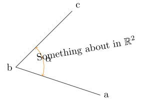
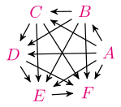
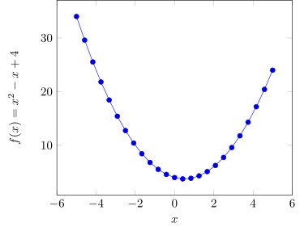



## LaTeX classes

You can create TikZ pictures using two available classes:

- `TexDocument(code, **options)`: Uses a full LaTeX document as code input (same effect as `-as=full-document`).
- `TexFragment(code, **options)`: Uses part of a LaTeX document as code input to create a standalone LaTeX document (same effect as `-as=standalone-document` or `-as=tikzpicture`).

For more details, please visit the [API reference](../api.md).

## Usage of TexDocument



First, let's import the `TexDocument` class from the package:

```python
from jupyter_tikz import TexDocument
```
Then, define the code:

```python
code = r"""\documentclass{standalone}
\usepackage{graphicx}
\usepackage{tikz}
\usepackage{amsfonts}
\usetikzlibrary{quotes,angles}
\begin{document}
	\scalebox{2}{
	\begin{tikzpicture}
		% Example from Paul Gaborit
		% http://www.texample.net/tikz/examples/angles-quotes/
		\draw
		    (3,-1) coordinate (a) node[right] {a}
		    -- (0,0) coordinate (b) node[left] {b}
		    -- (2,2) coordinate (c) node[above right] {c}
		    pic["$\alpha$", draw=orange, <->, angle eccentricity=1.2, angle radius=1cm]
		    {angle=a--b--c};
    
		\node[rotate=10] (r) at (2.5, 0.65) {Something about in $\mathbb{R}^2$};
	\end{tikzpicture}
	}
\end{document}"""
```

And create the `tex_document` object(1):
{ .annotate }

1.  You can obtain the code by printing the object.

```python
tex_document = TexDocument(code)
print(tex_document)  # To print the object displays the code
```
<div class="result">
<pre class="log-output">
\documentclass{standalone}
\usepackage{graphicx}
\usepackage{tikz}
\usepackage{amsfonts}
\usetikzlibrary{quotes,angles}
\begin{document}
	\scalebox{2}{
	\begin{tikzpicture}
		% Example from Paul Gaborit
		% http://www.texample.net/tikz/examples/angles-quotes/
		\draw
		    (3,-1) coordinate (a) node[right] {a}
		    -- (0,0) coordinate (b) node[left] {b}
		    -- (2,2) coordinate (c) node[above right] {c}
		    pic["$\alpha$", draw=orange, <->, angle eccentricity=1.2, angle radius=1cm]
		    {angle=a--b--c};
    
		\node[rotate=10] (r) at (2.5, 0.65) {Something about in $\mathbb{R}^2$};
	\end{tikzpicture}
	}
\end{document}
</pre>
</div>

### Run LaTeX

Finally, run LaTeX and display the output(1):
{ .annotate }

1.  You can configure the output by passing options to `run_latex`. In this example, `save_image` was used.

```python
tex_document.run_latex(save_image="outputs/angle")
```
<div class="result" markdown>

</div>

### Save the code

And save the code to a file:

```python
tex_document.save("outputs/angle.tex");
```

The output image and code will be saved in:

<pre class="log-card">
.
└─ outputs/
   └─ angle.tex
   └─ angle.svg
</pre>

## Working with Jinja

Firstly, let's create a Jinja template:

```python

jinja_code = r"""\documentclass[tikz]{standalone}
\usetikzlibrary{arrows,automata}
\definecolor{mymagenta}{RGB}{226,0,116}
\begin{document}
\begin{tikzpicture}[->,>=stealth',shorten >=1pt,auto,node distance=2.8cm,
                    semithick]
  \tikzstyle{every state}=[fill=mymagenta,draw=none,text=white]
  
  
       \node[color=mymagenta] (v{{loop.index0}}) at ({{angle}}:1) {${{name}}$};
  
  
  
      
         
             \path (v{{n1}}) edge (v{{n2}});
         
      
  
\end{tikzpicture}
\end{document}"""

```

You can render Jinja by passing the `use-jinja` option(1):
{ .annotate }

1.  If you are using Jinja, you must pass the `ns=<namespace>` parameter in order to allow the method to access the variables.

```python
tex_jinja_document = TexDocument(jinja_code, use_jinja=True, ns=locals())
print(tex_jinja_document)  # It prints the rendered Jinja Code
```
<div class="result">
<pre class="log-output">
\documentclass[tikz]{standalone}
\usetikzlibrary{arrows,automata}
\definecolor{mymagenta}{RGB}{226,0,116}
\begin{document}
\begin{tikzpicture}[->,>=stealth',shorten >=1pt,auto,node distance=2.8cm,
                    semithick]
  \tikzstyle{every state}=[fill=mymagenta,draw=none,text=white]
  
  \node[color=mymagenta] (v0) at (0:1) {$A$};
  \node[color=mymagenta] (v1) at (60:1) {$B$};
  \node[color=mymagenta] (v2) at (121:1) {$C$};
  \node[color=mymagenta] (v3) at (182:1) {$D$};
  \node[color=mymagenta] (v4) at (243:1) {$E$};
  \node[color=mymagenta] (v5) at (304:1) {$F$};
  \path (v0) edge (v1);
         \path (v0) edge (v2);
         \path (v0) edge (v3);
         \path (v0) edge (v4);
         \path (v0) edge (v5);
         \path (v1) edge (v2);
         \path (v1) edge (v3);
         \path (v1) edge (v4);
         \path (v1) edge (v5);
         \path (v2) edge (v3);
         \path (v2) edge (v4);
         \path (v2) edge (v5);
         \path (v3) edge (v4);
         \path (v3) edge (v5);
         \path (v4) edge (v5);
         \end{tikzpicture}
\end{document}
</pre>
</div>

Finally, run LaTeX and show the output:

```python
tex_jinja_document.run_latex(rasterize=True, dpi=150)
```

<div class="result" markdown>

</div>

## Usage of TexFragment

If you want to use parts of LaTeX, you can use the `TexFragment` class.

!!! tip
    `TexFragment` is a subclass of `TexDocument`, which means that all methods available in `TexDocument` are also available in `TexFragment`.

Now follows a basic example:

```python
# The code
tex_template_code = r"""\begin{axis}[
  xlabel=$x$,
  ylabel={$f(x) = x^2 - x +4$}
]
\addplot {x^2 - x +4};
\end{axis}"""

# The tikz object
tikz_picture = TexFragment(
    tex_template_code,
    implicit_tikzpicture=True, # If true wraps the template within a tikzpicture
    scale=1.5,
    tex_packages="pgfplots",
    no_tikz=True
)

# Run LaTeX
tikz_picture.run_latex()
```

<div class="result" markdown>

</div>